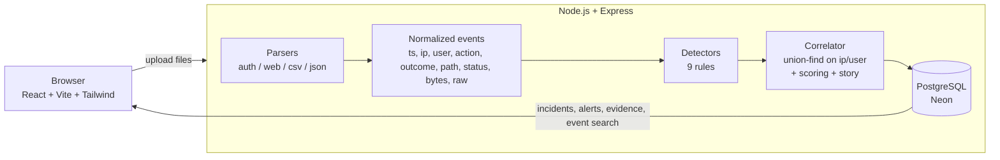

# LogHound: Find the Intruder

> ALGOTHON'26 · **PS ID: ALG-CYBER-01 (Cybersecurity: Find the Intruder)**

LogHound takes raw security logs (SSH `auth.log`, nginx/apache access logs, CSV/JSON exports), finds suspicious users and IPs, **connects related events across files into incidents**, and rebuilds the likely **attack sequence as a timeline**. Every claim points back to the raw log lines it came from.

The idea is to go past "this IP had 40 failed logins" and tell the analyst the whole story:

> *Attacker at 203.0.113.45 moved through 8 attack stages (Reconnaissance → Exploitation → Credential Access → Initial Access → Privilege Escalation → Persistence → Defense Evasion → Exfiltration) over 65 minutes, starting 01:48 UTC and ending up with access as deploy, mike.*

- **Live demo:** _add deployed URL here_
- **Demo video:** _add link here_

---

## Features

| Requirement (from PS) | How LogHound does it |
|---|---|
| Log ingestion | Upload up to 10 files at once. Format is auto-detected: Linux auth.log/secure (sshd, sudo, su, classic + RFC3339 timestamps), nginx/apache combined & common logs, CSV and JSON/JSON-lines with flexible column names. Unparseable lines are counted and reported, never crash the run. |
| Anomaly detection / rules | 9 explainable detection rules (table below), all thresholds in one config file. |
| Suspicious user / IP detection | Every flagged IP and account gets a 0-100 risk score with the list of rules that fired. |
| Event grouping | Alerts are joined into incidents with union-find over IPs and accounts (see *Correlation*). Auth and web logs get correlated together. |
| Incident timeline | Each incident has an ordered timeline mapped to kill-chain stages and a generated narrative summary. |
| Evidence | Every alert stores the exact events behind it. Click any timeline step to see the raw log lines with file name and line number. |
| **Bonus: attack sequence** | Kill-chain progression, a "what happened" summary, per-stage recommended actions, and a Markdown incident report export. |

**How the results page reads:**
1. **Your logs, line by line.** The uploaded file is shown with every suspicious line given a wavy underline, coloured by how serious it is. Long runs of normal lines are folded. Clicking a line opens a popup beside it (with an arrow pointing at the line) that explains *why the line is suspicious*, *what the risk is* in plain English, and which step of which attack it belongs to.
2. **Verdict.** At the end: "Someone broke in" / "Nothing confirmed, but a few things look odd" / "No signs of an attack", followed by the findings. Each finding opens the step-by-step incident timeline with evidence.
3. **Technical details** (folded): activity chart, flagged IPs & users with risk scores, all alerts, and a log search.

The home page has two demo files (`attack.log`, `normal.log`). You can **download** them and upload them by hand, or **check them straight away** with one click.

## Architecture



**Pipeline**

1. **Parse.** Each file goes through its parser and comes out as one normalized event shape. Files are merged into a single time-sorted timeline and each event gets a `seq` number, which is what evidence points to.
2. **Detect.** Each rule is a pure function `(events, config) → alerts`. It works on per-IP or per-user groups and splits them into "sessions" by time gaps, so a burst is one alert rather than 40.
3. **Correlate.** Alerts are linked into incidents (below), scored, and turned into a story with recommendations.
4. **Store.** Events, alerts and incidents go into Postgres in one transaction (bulk insert via `unnest`), so the UI can page through events and fetch evidence quickly.

### Main technical decisions

- **Rules instead of an ML model.** The PS judges detection quality *and explainability*. Every alert says exactly why it fired ("46 failed logins in 15 min against 9 accounts") and links to the lines. A black-box anomaly score can't do that, and there's no labelled training data anyway.
- **Per-entity baselines where it matters.** "Unusual login" compares a user against *their own* history (IPs used before, usual hours), not a global rule.
- **One normalized event model.** Adding a new log format means writing a parser and nothing else; detectors don't care where an event came from.
- **Postgres for results, analysis in memory.** Analysis of ~5k events takes ~30 ms. The DB is for persistence, evidence lookup and the paginated event explorer.

## Detection rules

| Rule | Stage | Fires when | Default threshold |
|---|---|---|---|
| Brute force | Credential Access | Many failed logins from one IP in a short window | ≥10 failures within 5 min |
| Password spray | Credential Access | One IP tries many different usernames | ≥5 usernames in a 15 min session |
| Compromised login | Initial Access | A **successful** login right after a run of failures from the same IP (or on the same account) | ≥5 failures in the previous 30 min |
| Unusual login | Initial Access | User logs in from an IP they have never used (severity goes up if it's also outside their usual hours) | needs ≥3 earlier logins as baseline |
| Sensitive command | Priv. Esc / Persistence / Defense Evasion / Exfiltration | sudo/su commands such as reading `/etc/shadow`, `useradd`, editing `authorized_keys`, crontab, clearing logs, `tar`/`scp`/`mysqldump` of data | pattern lists in `detectors/commands.js` |
| Sudo denied | Privilege Escalation | User not in sudoers / wrong sudo password | any |
| Web scanning | Reconnaissance | Lots of 4xx, probes for `.env`, `.git`, `wp-admin`, `phpmyadmin`…, or scanner user-agents | ≥20 4xx or ≥3 probe paths per 10 min |
| Injection payload | Exploitation | SQLi, XSS, path traversal, command injection or JNDI strings in URLs. Severity is raised if the server returned a non-error response | any |
| Large data transfer | Exfiltration | Responses far larger than normal | ≥5 MB **and** ≥50× the median response size |

All thresholds are in [`server/src/detectors/config.js`](server/src/detectors/config.js).

## Correlation and scoring

- Every alert belongs to an entity (`ip:…` or `user:…`). Entities are merged with **union-find** when:
  - an alert involves both (e.g. *compromised login* = user + source IP), or
  - a **flagged** IP successfully logs in as an account (SSH or web).
  
  That's how the web scan, the SSH brute force, the `sudo cat /etc/shadow` by `deploy` and the 186 MB export by `mike` end up in **one** incident. Only flagged IPs create links, so a shared office IP doesn't glue unrelated users together.
- **Incident score** = strongest alert + 25% of the other rules' weights + 10 points for every extra kill-chain stage (capped at 100). A brute force that went nowhere stays *medium*; brute force → login → privilege escalation → exfiltration is *critical*.
- Low-confidence single signals are worded as such ("likely benign on its own"), not as "attacker".

## Testing

```bash
cd server && npm test
```

**42 tests** (Vitest):

- **Parsers:** each format, timezone offsets, URL-decoding of payloads, malformed lines being skipped, format auto-detection, merging files.
- **Detectors:** each rule fires on the attack pattern **and stays quiet on the look-alike normal case** (a user mistyping their password twice, slow scattered failures, a few 404s, routine `sudo systemctl restart nginx`, normal query strings, normal-size downloads).
- **End-to-end scenario:** [`scripts/generate-logs.js`](server/scripts/generate-logs.js) generates 3 days of realistic logs (~4,600 events: 6 engineers, 12 app users, a CI deploy account, ~800 anonymous visitors, internet SSH noise) with **one planted multi-stage attack** and some distractors. The test checks that:
  - the attack is the top incident, critical, with all 8 stages in the right order;
  - the noisy-but-failed brute force from another IP is a *separate, lower* incident;
  - **no normal employee, the CI server or routine admin work gets flagged**;
  - it all holds across 4 other random seeds;
  - **clean logs produce zero alerts** (3 seeds).

The generated files are in [`samples/`](samples/):

| File | What's in it | Expected result |
|---|---|---|
| `attack.log` | 3 days of normal SSH activity with a break-in hidden inside | "Someone broke in" (from 203.0.113.45 as `deploy`) |
| `normal.log` | 3 days of normal SSH activity only | "No signs of an attack" (0 alerts) |
| `auth.log` + `access.log` | the full scenario, SSH + website logs (upload both together) | 1 break-in across both files, all 8 stages |

The **"Try the demo"** button in the UI runs the full scenario.

## Run locally

Requirements: Node 20+, a Postgres database (a free [Neon](https://neon.tech) DB works).

```bash
# api
cd server
cp .env.example .env        # set DATABASE_URL
npm install
npm run dev                 # http://localhost:5050, creates tables on start

# web (new terminal)
cd client
npm install
npm run dev                 # http://localhost:5173, proxies /api to :5050
```

Regenerate sample logs: `cd server && npm run generate`

### API

| Method | Path | |
|---|---|---|
| `POST` | `/api/uploads` | multipart `files` (up to 10), optional `formats=auth,web`, `year` for syslog timestamps |
| `POST` | `/api/uploads/sample` | analyze the built-in sample scenario |
| `GET` | `/api/uploads` | previous analyses |
| `GET` | `/api/uploads/:id` | stats, chart data, incidents, alerts, entities |
| `GET` | `/api/uploads/:id/incidents/:ref` | incident with alerts and evidence events |
| `GET` | `/api/uploads/:id/events?ip=&user=&source=&outcome=&q=&limit=&offset=` | event explorer |
| `DELETE` | `/api/uploads/:id` | delete an analysis |

## Deployment

Everything runs as **one Render web service** (`render.yaml`): the build step builds the React app, and Express serves both `/api/*` and the built frontend from `client/dist`. That means one URL and no CORS setup.

- Build: `npm ci --prefix server && npm ci --prefix client --include=dev && npm run build --prefix client`
- Start: `npm start --prefix server`
- Env: `DATABASE_URL` (Neon Postgres). The schema is applied automatically on startup.

## Known limitations

- Syslog lines have no year or timezone. The year comes from the upload (defaults to current) and times are treated as UTC.
- No GeoIP, so no "impossible travel" detection yet.
- Thresholds are static defaults. Very large or very quiet environments would need tuning.
- Analysis runs in memory per upload (limit 250k events / 25 MB per file). Huge log sets would need streaming.
- Sensitive-command detection only sees what sudo/su logs, not every shell command.
- No authentication: anyone with the URL can upload and see analyses. Fine for a demo, not for real data.

## Future improvements

- GeoIP + impossible travel, ASN reputation / threat-intel lookups for IPs
- Thresholds editable from the UI, per-environment baselines learned over time
- More formats: Windows Event Log (4624/4625), AWS CloudTrail, firewall logs
- Streaming ingestion and live tailing instead of one-off uploads
- Login + per-team workspaces, mark incidents as resolved / false positive

## External services, data and AI disclosure

- **Libraries:** Express, pg, multer, cors, dotenv, Vitest; React, React Router, Recharts, lucide-react, Tailwind CSS, Vite.
- **Services:** Neon (Postgres hosting). No external APIs are called during analysis, and no LLM is used at runtime. Detection and story generation are deterministic code.
- **Data:** all sample logs are synthetic, generated by `server/scripts/generate-logs.js`. The attacker (203.0.113.45) and the failed brute-forcer (198.51.100.77) use reserved documentation ranges; other public IPs are random.
- **AI-assisted development:** _(edit this to match what you actually did)_ Claude (Anthropic) was used as a coding assistant to write a large part of the code and tests. I chose the problem statement, tech stack and scope, and directed the design. I reviewed the code, ran the app and tests, and verified the results.
